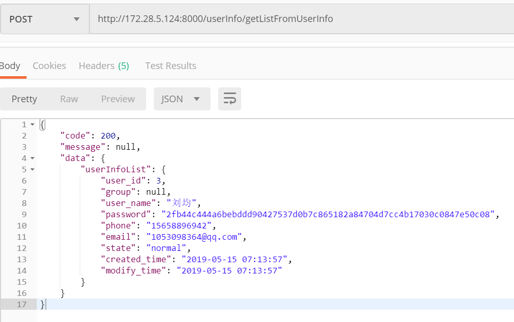

## django 基础框架设计
 > 由于rest_framework 开发api实在太麻烦，而且写一些繁琐的业务逻辑十分不方便
 > 本项目设计，直接将查询出来的orm对象转换为json格式，不管是多表查询，还是什么查询，都能转。
 > 注意点，下次说吧，如果真的需要，你联系我，我给你讲，很简答的
 
 - urls对应每个app应用分离
 - models拆分为每个基础类
 - views拆分为contoller与dao
 - sdk_api api对接
 - utils 工具包   自带固定格式的json转换
 
## 安装

  1. 下载git源码
  ```java
  git clone https://github.com/Tender-Liu/django-Layout-design.git
  ```
  暂时不想写！！！！看图吧，联系方式自己看图吧
  
  
  