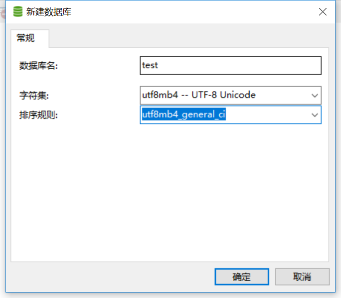
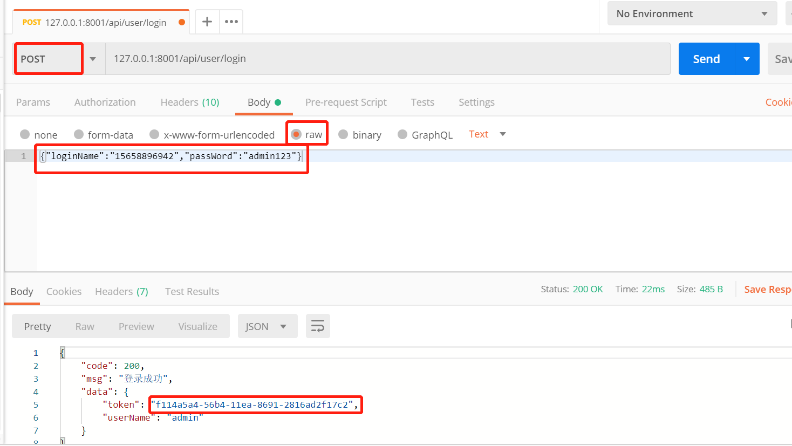
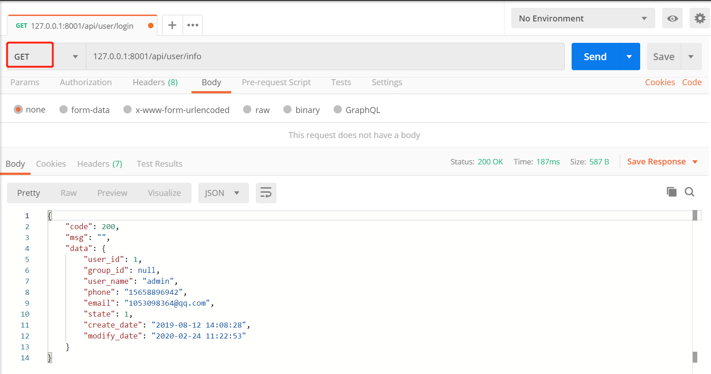

## 框架结构介绍

### 依赖组件介绍
* 要求python版本为3.6+，使用到的第三方库：
* tornado 作为基础框架
* oslo.config 作为配置管理
* oslo.log 日志管理
* sqlalchemy 作为mysql mapper
* redis 操作redis，目前登陆token存放在redis中
```java
    # 主框架
    pip install tornado==6.0.3
    # 模板渲染
    pip install Jinja2==2.10
    # 数据库组件
    pip install SQLAlchemy==1.3.5
    pip install PyMySQL==0.9.2
    
    # 通过pip install mysqlclient时报出了OSError: mysql_config not found错误
    # linux 系统缺少依赖组件 解决：yum install mysql-devel gcc gcc-devel python-devel
    pip install mysqlclient==1.4.2
    # 配置与日志
    pip install oslo.config==6.11.0
    pip install oslo.log==3.44.0
    # 后期扩展使用
    pip install oslo.centext==2.22.1
    pip install oslo.utils==3.41.0
    # redis
    pip install redis==3.0.1
```


### 1. config (配置文件)
1. 文件配置管理,使用openstack的 oslo.config 作为配置管理
2. 针对测试环境，启动时可以指定配置文件启动，配置有help语法
```java
    # 指定配置文件启动, 默认就是config.ini
    python application.py --config-file=config/qa-config.ini
    # help语法
    python application.py -h
```

### 2. dbinfo （sql目录）
1. sql文件目录，保存每次更新sql内容

### 3. handlers （接口层）
1. 对应controllers层，按照业务编写指定api
2. handlers代码中，只允许编写判断前端入参与出参，以及请求方式，不允许编写业务逻辑代码与sql
3. resulfull功能   get=查询  post=新增 delete=删除 put=更新

### 4. library （公共工具层）
1. 对用公共组件层，针对各项目api对应，工具类编写等，后期jenkins zabbix等项目api对接，都在这里编写
2. Decoreate.py  常用装饰器 sql操作事物， headlers统一格式处理化
3. urls.py   每个headlers文件，都要在此文件中注册
4. Exception.py 在这里自定义自己的异常，使用时只需在代码中抛出该异常即可
5. Overall.py 这是一个单例类，常用的中间件都会放到此类中操作。
6. Handlers.py Handlers中的具体操作类可根据具体情况继承该文件中的Handler。
7. MyRedis.py redis操作封装
8. Utils.py 常用工具类函数
9. Route.py 负责管理所有的请求地址与逻辑处理类的映射

### 5. marpper （数据操作层）
1. sql语句功能编写，禁止编写代码逻辑代码，
2. basemarpper中有公共方法，编写的自定义mapper继承，可以直接使用

### 6. models （数据映射层）
1. 每个文件对应每张sql数据表，一一对应
2. basemodel中包含公共方便，保留的功能

### 7. servce （业务逻辑层）
1. 编写业务逻辑代码，不允许有sql语句操作，调用mapper中update，insert，delete方法时，请使用@Transaction(name='session')注解功能，带有事物功能

### 8. templates （模板层）
1. html页面

### 9. test (测试用例)
1. 测试用例编写

=============================
1. 准备对应的mysql数据库
    
2. 准备对用的redis数据库
3. 执行base.sql 文件，
4. 修改config.ini 配置文件内容
5. 用户登录账号为手机号或者邮箱, 账户：15658896942 或 1053098364@qq.com 密码：admin123
6. 除了登录api，其余api都需要在headers中添加X-Token参数
7. 请求参数为raw中的json字符串
    
    
    
    